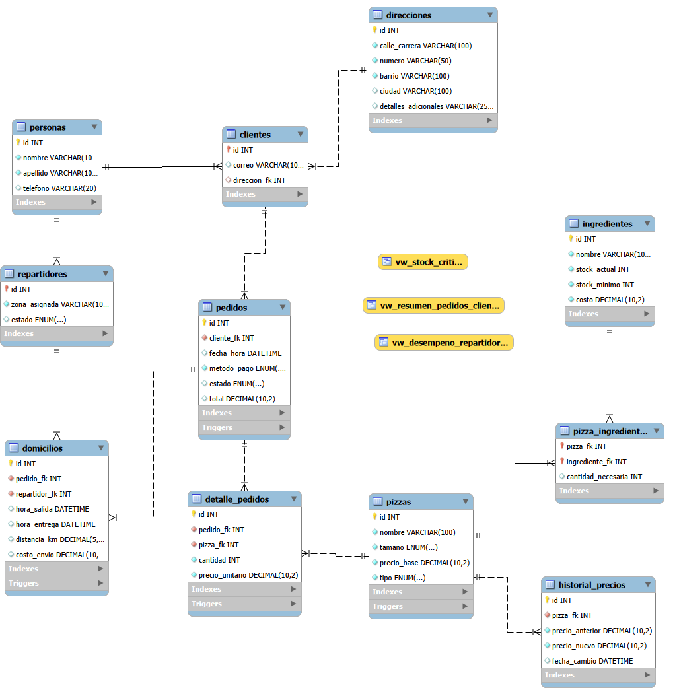

# 🍕 Sistema de Gestión - Pizzería Don Piccolo

Sistema de base de datos relacional en MySQL diseñado para centralizar y automatizar el ciclo operativo de ventas y logística de domicilios de **Pizzería Don Piccolo**. Cubre desde el registro y seguimiento de clientes, control de recetas e inventario, auditoría de precios y asignación de repartidores, hasta la facturación y reportes analíticos.

---

## 📌 Diagrama Entidad-Relación (EER)



---

## 🗂️ Estructura del Proyecto

```text
pizzeria-don-piccolo/
 ├── database.sql       # Definición de tablas, tipos de datos y llaves foráneas (3FN)
 ├── funciones.sql      # Funciones de cálculo financiero y procedimientos almacenados
 ├── triggers.sql       # Disparadores de auditoría, control de inventario y estados
 ├── vistas.sql         # Vistas directivas para reportería y control de existencias
 ├── inserts.sql        # Poblado de datos de prueba para validación del sistema
 ├── consultas.sql      # Consultas analíticas complejas del negocio
 └── README.md          # Documentación técnica y funcional del proyecto
```

---

## 🛠️ Explicación del Modelo y Relaciones

* **Normalización y Herencia (Superclase/Subclase):** Se implementa la tabla `personas` como superclase para centralizar atributos compartidos (nombre, apellido, teléfono). Las tablas `clientes` y `repartidores` actúan como subclases, compartiendo la clave primaria (relación 1:1) para garantizar normalización en 3FN y evitar duplicidad.
* **Normalización de Direcciones:** Las direcciones físicas se desacoplan en la tabla `direcciones`. Esto permite actualizar domicilios sin alterar la entidad del cliente y reutilizar esquemas geográficos.
* **Precios Históricos Congelados:** La tabla `detalle_pedidos` captura y congela el precio unitario del catálogo al momento exacto de la compra mediante el trigger `trg_set_precio_unitario`, protegiendo la facturación histórica frente a variaciones de precio en el menú.
* **Recetas e Inventario (Relación N:M):** La tabla pivote `pizza_ingredientes` asocia los productos del menú con sus insumos necesarios, permitiendo validar y descontar stock automáticamente por porción.
* **Auditoría de Modificaciones:** Cada variación en la columna `precio_base` de `pizzas` genera automáticamente un registro histórico en `historial_precios` detallando el valor anterior, el nuevo precio y la marca temporal del cambio.

---

## ⚙️ Reglas de Negocio Automatizadas

* **Cálculo Total con IVA (19%):** La función `calcular_total_pedido()` calcula el valor sumando los subtotales con precios congelados, adiciona el costo de entrega por distancia y aplica el IVA legal del 19%.
* **Control Estricto de Stock:** El trigger `trg_validar_stock` evalúa la disponibilidad de inventario antes de admitir una pizza en un pedido. Si los insumos son suficientes, `trg_actualizar_stock` descuenta las existencias automáticamente tras registrar el detalle.
* **Gestión de Despachos y Flota:** Al asignar un pedido en `domicilios`, el repartidor cambia su estado a `no disponible` y se liquida el costo de envío (tarifa base de $3.000 + $1.200 por km). Al completarse la entrega con el procedimiento `sp_registrar_entrega()`, el repartidor se restablece a `disponible`.
* **Cancelación Segura:** Cuando un pedido se cancela, el trigger `trg_manejar_cancelacion_pedido` reincorpora automáticamente las porciones de ingredientes al inventario y libera al repartidor asignado.

---

## 🚀 Instrucciones de Ejecución

Para mantener la integridad referencial y asegurar la compilación adecuada de funciones y disparadores, ejecutar los scripts en el siguiente orden estricto:

1. **`database.sql`** (Crea la base de datos y la arquitectura relacional)
2. **`funciones.sql`** (Registra las funciones y procedimientos almacenados)
3. **`triggers.sql`** (Instala los disparadores de automatización y auditoría)
4. **`vistas.sql`** (Construye las vistas de reportería)
5. **`inserts.sql`** (Carga datos de prueba para clientes, ingredientes, menú y pedidos)
6. **`consultas.sql`** (Ejecuta las consultas de verificación y reportes analíticos)

---

## 📊 Vistas del Sistema

* **`vw_resumen_pedidos_cliente`:** Consolida el nombre completo del cliente, correo, total de órdenes realizadas y dinero total gastado.
* **`vw_desempeno_repartidores`:** Calcula el número total de entregas finalizadas y el tiempo promedio de despacho (en minutos) agrupado por zona.
* **`vw_stock_critico`:** Identifica ingredientes cuyas existencias actuales son inferiores al stock mínimo de seguridad e indica la cantidad requerida para abastecimiento.

---

## 🔍 Ejemplos de Consultas Analíticas

### 1. Clientes con pedidos entre dos fechas (`BETWEEN`)
```sql
SELECT 
    p.id AS pedido_id,
    CONCAT(per.nombre, ' ', per.apellido) AS cliente,
    p.fecha_hora,
    p.total
FROM pedidos p
JOIN clientes c ON p.cliente_fk = c.id
JOIN personas per ON c.id = per.id
WHERE p.fecha_hora BETWEEN '2026-08-01 00:00:00' AND '2026-08-31 23:59:59';
```

### 2. Pizzas más vendidas (`GROUP BY` y agregaciones)
```sql
SELECT 
    piz.nombre AS pizza,
    SUM(dp.cantidad) AS total_unidades_vendidas,
    COUNT(dp.id) AS veces_pedida
FROM detalle_pedidos dp
JOIN pizzas piz ON dp.pizza_fk = piz.id
GROUP BY piz.id, piz.nombre
ORDER BY total_unidades_vendidas DESC;
```

### 3. Pedidos por repartidor (`JOIN`)
```sql
SELECT 
    d.id AS domicilio_id,
    p.id AS pedido_id,
    CONCAT(per.nombre, ' ', per.apellido) AS repartidor,
    p.estado AS estado_pedido,
    d.hora_salida,
    d.hora_entrega
FROM domicilios d
JOIN repartidores r ON d.repartidor_fk = r.id
JOIN personas per ON r.id = per.id
JOIN pedidos p ON d.pedido_fk = p.id;
```

### 4. Promedio de entrega por zona (`AVG` y `JOIN`)
```sql
SELECT 
    r.zona_asignada AS zona,
    ROUND(AVG(TIMESTAMPDIFF(MINUTE, d.hora_salida, d.hora_entrega)), 1) AS promedio_minutos_entrega
FROM domicilios d
JOIN repartidores r ON d.repartidor_fk = r.id
WHERE d.hora_entrega IS NOT NULL
GROUP BY r.zona_asignada;
```

### 5. Clientes con alto volumen de gasto (`HAVING`)
```sql
SELECT 
    CONCAT(per.nombre, ' ', per.apellido) AS cliente,
    COUNT(p.id) AS total_pedidos,
    SUM(p.total) AS gasto_acumulado
FROM clientes c
JOIN personas per ON c.id = per.id
JOIN pedidos p ON c.id = p.cliente_fk
WHERE p.estado = 'entregado'
GROUP BY c.id, per.nombre, per.apellido
HAVING SUM(p.total) > 100000;
```

### 6. Búsqueda por coincidencia parcial (`LIKE`)
```sql
SELECT 
    id, 
    nombre, 
    tamano, 
    precio_base, 
    tipo
FROM pizzas
WHERE nombre LIKE '%especial%' OR nombre LIKE '%pollo%';
```

### 7. Clientes frecuentes con más de 5 pedidos al mes (Subconsulta)
```sql
SELECT 
    c.id,
    CONCAT(per.nombre, ' ', per.apellido) AS cliente_frecuente,
    c.correo,
    sub.pedidos_mes
FROM clientes c
JOIN personas per ON c.id = per.id
JOIN (
    SELECT 
        cliente_fk, 
        COUNT(id) AS pedidos_mes
    FROM pedidos
    WHERE MONTH(fecha_hora) = MONTH(CURRENT_DATE()) 
      AND YEAR(fecha_hora) = YEAR(CURRENT_DATE())
      AND estado = 'entregado'
    GROUP BY cliente_fk
    HAVING COUNT(id) > 5
) sub ON c.id = sub.cliente_fk;
```